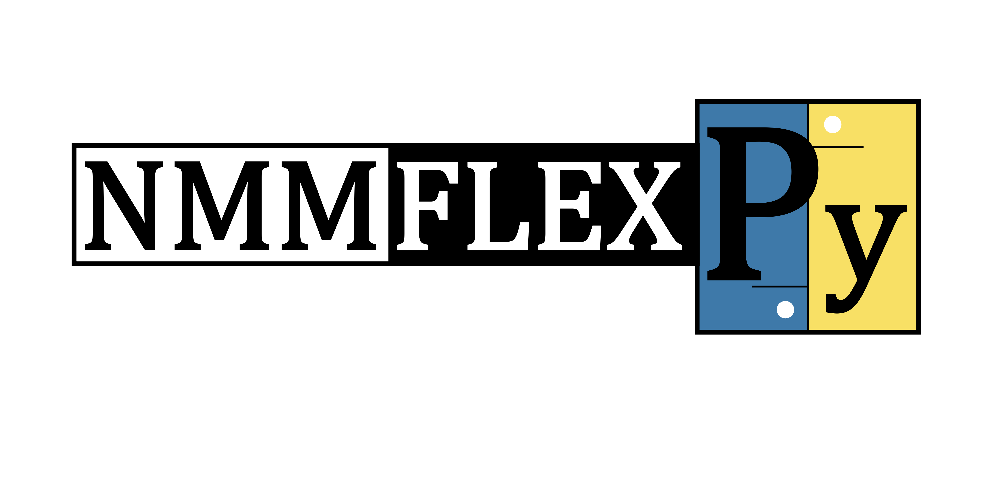

<!-- PROJECT LOGO -->
<br />
<div align="center">
    
</div>


# NMMFlex in Python (NMMFlexPy)

Introducing NMMFlex, a Python package that enhances and extends the functionality of the Non-negative Multiple Matrix Factorization (NMMF) algorithm. This innovative solution, originally proposed by [Takeuchi et al. (2013)](https://www.ijcai.org/Proceedings/13/Papers/254.pdf), has been refined and adapted through our package to maximize its potential. NMMFlex offers an advanced implementation, bringing significant improvements and bespoke modifications to the core NMMF algorithm.

## Installation

You can install NMMFlexPy using pip:

```shell
pip install NMMFlex
```

NMMFlexPy requires the following dependencies, which will be installed automatically:

- numpy>=1.24.3
- pandas>=2.0.2
- pyparsing>=3.0.7
- scipy>=1.10.1
- deprecation>=2.1.0
- sphinx>=7.0.1
- scikit-learn>=1.2.2
- setuptools>=67.8.0
- pytest>=7.3.1
- pytest-cov>=4.1.0

## Usage

Once installed, you can import and use the NMMFlexPy package in your Python code:

```python
import NMMFlex

# Use the functionalities provided by NMMFlex
```

For detailed documentation, please refer to the [NMMFlex Documentation](https://www.github.com/crhisto/NMMFlex/NMMFlexPy/NMMFlex/docs/build/index.html).

## Running the main deconvolution function

The `run_deconvolution_multiple` function is part of the `NMMFlex` class and is designed to perform matrix deconvolution using three input matrices, `x_matrix`, `y_matrix`, and `z_matrix`, and a rank, `k`. 

## Function Signature

```python
def run_deconvolution_multiple(self, x_matrix, y_matrix, z_matrix, k, gamma=1, alpha=0.0, beta=0.0,
                               delta_threshold=1e-10, max_iterations=200, print_limit=100,
                               proportion_constraint_h=True,
                               regularize_w=None, alpha_regularizer_w=0,
                               fixed_w=None, fixed_h=None, fixed_a=None, fixed_b=None,
                               initialized_w=None, initialized_h=None, initialized_a=None, initialized_b=None,
                               init_method_w='random_based.uniform', init_method_h='random_based.uniform',
                               init_method_a='random_based.uniform', init_method_b='random_based.uniform',
                               verbose=True)
```

## Parameters

- `x_matrix (numpy.ndarray)`: Input matrix corresponding to a dataframe.
- `y_matrix (numpy.ndarray)`: Input matrix.
- `z_matrix (numpy.ndarray)`: Input matrix.
- `k (numpy.ndarray)`: The Rank used for deconvolution.
- `gamma (float, optional)`: The gamma parameter value. Default is 1.
- `alpha (float, optional)`: The alpha parameter value. Default is 0.0.
- `beta (float, optional)`: The beta parameter value. Default is 0.0.
- `delta_threshold (float, optional)`: The convergence threshold for stopping the deconvolution iterations. Default is 1e-10.
- `max_iterations (int, optional)`: The maximum number of iterations to perform during deconvolution. Default is 200.
- `print_limit (int, optional)`: The iteration interval at which to print progress messages during deconvolution. Default is 100.
- `proportion_constraint_h (bool, optional)`: Whether to apply a proportion constraint to matrix H. Default is True.
- `regularize_w (numpy.ndarray or None, optional)`: The regularization matrix for W. Default is None.
- `alpha_regularizer_w (float, optional)`: The alpha regularization parameter for W. Default is 0.
- `fixed_w (numpy.ndarray or None, optional)`: The fixed matrix for W. Default is None.
- `fixed_h (numpy.ndarray or None, optional)`: The fixed matrix for H. Default is None.
- `fixed_a (numpy.ndarray or None, optional)`: The fixed matrix for A. Default is None.
- `fixed_b (numpy.ndarray or None, optional)`: The fixed matrix for B. Default is None.
- `initialized_w (numpy.ndarray or None, optional)`: The initial value for W. Default is None.
- `initialized_h (numpy.ndarray or None, optional)`: The initial value for H. Default is None.
- `initialized_a (numpy.ndarray or None, optional)`: The initial value for A. Default is None.
- `initialized_b (numpy.ndarray or None, optional)`: The initial value for B. Default is None.
- `init_method_w (str, optional)`: The initialization method for W. Default is 'random_based.uniform'.
- `init_method_h (str, optional)`: The initialization method for H. Default is 'random_based.uniform'.
- `init_method_a (str, optional)`: The initialization method for A. Default is 'random_based

## Code example

This code first imports numpy and creates an instance of the class containing the run_deconvolution_multiple function. It then defines the input matrices and rank, as well as optional parameters for the function. Finally, it calls the function and stores the deconvoluted matrix in deconvoluted_matrix. The function run_deconvolution_multiple is designed to perform matrix deconvolution using three input matrices, x_matrix, y_matrix, and z_matrix, and a rank, k. The parameters gamma, alpha, and beta control the balance between different parts of the deconvolution process. The function also supports various customization options, such as the maximum number of iterations, regularization, initialization methods, and more.

```python
import numpy as np

# An instance of the class which has the method
obj = MyClass()

# Define the three matrices and k
x_matrix = np.random.rand(10, 10)
y_matrix = np.random.rand(10, 10)
z_matrix = np.random.rand(10, 10)
k = 5

# Optional parameters
gamma = 0.8
alpha = 0.1
beta = 0.1
delta_threshold = 1e-8
max_iterations = 500
print_limit = 50
proportion_constraint_h = False
regularize_w = np.random.rand(10, 10)
alpha_regularizer_w = 0.5
fixed_w = np.random.rand(10, 10)
fixed_h = np.random.rand(10, 10)
fixed_a = np.random.rand(10, 10)
fixed_b = np.random.rand(10, 10)
init_method_w = 'random_based.uniform'
init_method_h = 'random_based.uniform'
init_method_a = 'random_based.uniform'
init_method_b = 'random_based.uniform'
verbose = True

# Call the function
deconvoluted_matrix = obj.run_deconvolution_multiple(x_matrix, y_matrix, z_matrix, k, gamma=gamma, alpha=alpha,
                                                     beta=beta, delta_threshold=delta_threshold,
                                                     max_iterations=max_iterations, print_limit=print_limit,
                                                     proportion_constraint_h=proportion_constraint_h,
                                                     regularize_w=regularize_w,
                                                     alpha_regularizer_w=alpha_regularizer_w, fixed_w=fixed_w,
                                                     fixed_h=fixed_h, fixed_a=fixed_a, fixed_b=fixed_b,
                                                     init_method_w=init_method_w, init_method_h=init_method_h,
                                                     init_method_a=init_method_a, init_method_b=init_method_b,
                                                     verbose=verbose)
```

Please refer to the NMMFlexPy documentation for more details on the `run_deconvolution_multiple` function, parameters and related functionalities.

## Package Installation and Uninstallation Guide

You have the flexibility to use either Python3 or pip for installing and uninstalling packages. Follow the steps below:

First, navigate to the 'NMMFlexPy' directory:
```shell
cd NMMFlexPy
```
To install the package, you can either use the Python3 setup script:
```shell
# Install using Python3 setup script
python3 setup.py install
```
Or you can use pip to install the package:
```shell
# Install using pip
pip install .
```
To confirm the successful installation, inspect the list of installed packages and check if 'NMMFlexPy' is included:
```shell
# Display list of installed packages
pip list
```
In case you need to uninstall the package at any point, use the following command:
```shell
# Uninstall the package
pip uninstall NMMFlex
```
We hope you find this guide helpful. If you encounter any issues or require further assistance, don't hesitate to reach out.

## Generating Documentation: Docstrings in Google Style

This project adheres to the Google style for docstrings in Python documentation. You can access the most recent report by clicking [here](docs/build/index.html). To generate the most recent version of the documentation, you need to install Sphinx first. If you haven't already installed Sphinx, you can do so by running the following command:

```shell
pip install sphinx
```

Once Sphinx is installed, you can generate the documentation by executing the command below from the directory `[relative_path]/NMMFlexPy/NMMFlex/docs`:

```shell
sphinx-build -b html source build
```

## Running Test Cases and Code Coverage Analysis

Our code currently boasts a 90% code coverage. You can access the most recent report by clicking [here](../htmlcov/index.html). To generate a new report with the latest code, you first need to install pytest and pytest-cov. You can do this by running the following command:

```shell
pip install pytest pytest-cov
```

With pytest and pytest-cov installed, you can generate the code coverage report by executing the following command from the directory `[relative_path]/NMMFlexPy`:

```shell
pytest --cov=NMMFlex tests/ --cov-report=html
```

## CI Pipeline

The project has a CI pipeline configured in GitHub Actions. The pipeline performs the following steps:

1. **Install Dependencies**: Installs the project dependencies required for the build process.
2. **Lint with Ruff**: Runs the linter to check for any code style or formatting issues.
3. **Run Unit Tests**: Executes all the unit tests to ensure the functionality of the project.
4. **Calculate Test Coverage**: Measures the test coverage of the project to assess code quality.

You can find the status of the CI pipeline in the badge at the top of this README.

## Contributing, comments and bugs

Contributions are welcome! If you have suggestions, bug reports, or feature requests, please open an issue on the [NMMFlex GitHub repository](https://github.com/crhisto/NMMFlex/).

If you would like to contribute code, please follow these steps:

1. Fork the repository and clone it to your local machine.
2. Create a new branch for your feature or bug fix.
3. Develop and test your changes.
4. Commit your changes and push them to your forked repository.
5. Open a pull request describing your changes.

## License

This project is licensed under the [GNU General Public License (GPL) version 3](LICENSE).
