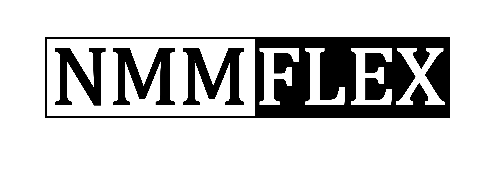
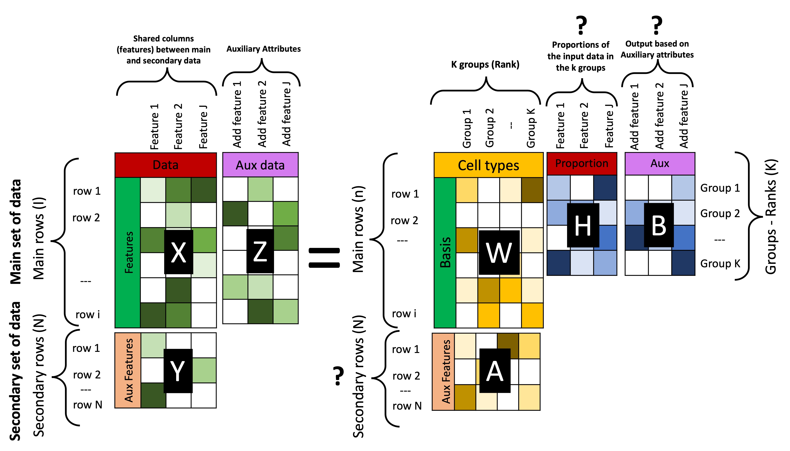
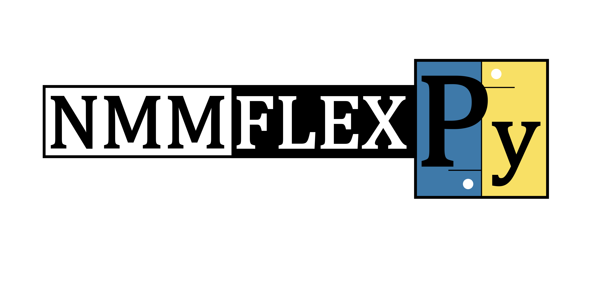
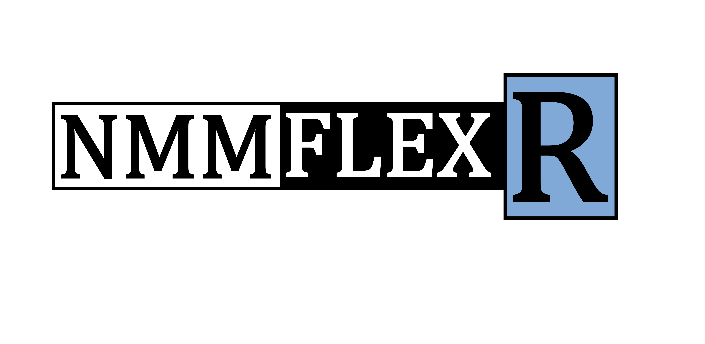

# NMMFlex: A Comprehensive Non-negative Multiple Matrix Factorization (NMMF) Solution

<!-- Diagram with NMMFlex -->
 

    

## Overview
Welcome to NMMFlex, a repository designed to house a robust implementation of the Non-negative Multiple Matrix Factorization (NMMF) algorithm. The original version, proposed by Takeuchi et al. in 2013, has been meticulously refined and enhanced to augment its potential.

The NMMF algorithm excels at factoring a specified matrix into two non-negative matrices, enabling efficient matrix approximation within non-negativity constraints. With applicability in diverse areas such as image processing, recommendation systems, and text mining, NMMF continues to prove its relevance and value.

<!-- Diagram with NMMFlex generic configuration -->
 

    

Within this repository, we present two versions of the NMMF algorithm for your convenience:
- **NMMFlexPy**: A Python native version of the NMMF algorithm. It provides a flexible and efficient implementation for performing matrix factorization with non-negativity constraints. The code is written in Python and can be easily integrated into your projects.

<!-- Diagram with NMMFlexPy -->
 

    

- **NMMFlexR**: An R wrapper for the NMMF algorithm. This version allows R users to utilize the NMMF algorithm within their R environment. The wrapper provides a convenient interface to access the functionality of the NMMFlexPy implementation.

<!-- Diagram with NMMFlexR -->
 

    

Both versions of the algorithm aim to factorize a given matrix into two non-negative matrices that approximate the original matrix. The NMMF algorithm has proven effective in various applications such as deconvolution of Omic Data (DecoFlex), image processing, recommendation systems, and text mining.

## Installation and Guidance
For each version, you'll find a dedicated subdirectory that offers comprehensive instructions and practical usage examples:
- [NMMFlexPy](github.com/crhisto/NMMFlex/NMMFlexPy/): For the Python implementation. (Currently under development)
- [NMMFlexR](github.com/crhisto/NMMFlex/NMMFlexR/): For the R wrapper. (Currently under development)

Please navigate to the specific README files in these subdirectories for step-by-step installation guidelines and detailed usage instructions.

## Citing our Work
If this NMMF implementation proves valuable for your research or projects, we kindly ask you to cite the original work in your publications and also our publication, as per the following:
- Cardona, C., & Schweikert, G. et al (2023). DecoFlex: a flexible joined cell-type decomposition with multiomic epigenetic data. (Manuscript in the process of review for submission and forthcoming publication).
- Takeuchi, M., Igarashi, Y., & Tanaka, T. (2013). [Non-Negative Multiple Matrix Factorization](https://www.ijcai.org/Proceedings/13/Papers/254.pdf). Proceedings of the Twenty-Third International Joint Conference on Artificial Intelligence. 2013

## Contributing
We warmly welcome contributions to the development of our NMMF algorithm implementation. If you discover any issues, have recommendations for enhancements, or wish to contribute new features, please feel free to open an issue or submit a pull request.

## Licensing
This project falls under the GNU General Public License (GPL). The full license text can be found within the [LICENSE](./LICENSE) file.

## Reach Out
Should you have any inquiries or require further assistance, we encourage you to get in touch:
- Crhistian Cardona: [crhisto@gmail.com](mailto:crhisto@gmail.com)

We truly appreciate your interest in our NMMF algorithm implementation and eagerly look forward to your feedback.

Happy multiple matrix factorizing!
